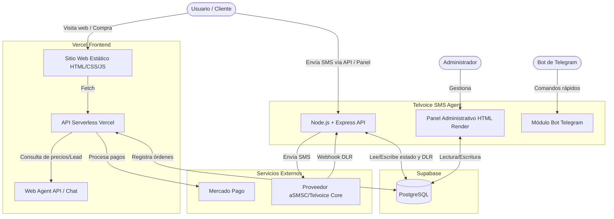

# Análisis del Repositorio Telvoice.cl

Este documento presenta un análisis estructurado del repositorio `telvoice.cl`, detallando su arquitectura, funcionalidades principales, modo de uso, y componentes clave (como los agentes integrados).

## 1. Visión General
El repositorio corresponde a la plataforma **Telvoice.cl**, un servicio chileno de envío masivo de SMS prepago. El modelo de negocio permite la compra online de bolsas de SMS (con Mercado Pago) y ofrece herramientas para envío de campañas, notificaciones, y OTP (One-Time Password) mediante una API REST o un panel de gestión.

El repositorio se divide principalmente en dos grandes bloques:
1. **Frontend Público y API Serverless (Vercel):** El sitio web principal (`index.html`, CSS, JS estáticos) y funciones serverless bajo la carpeta `/api` que manejan cobros, contacto y un agente web.
2. **Backend de Envío SMS (Telvoice SMS Agent):** Una aplicación en Node.js, Express y TypeScript alojada en la carpeta `/telvoice-sms-agent`, que se encarga de la lógica core del envío de mensajes, integración con proveedores, y paneles de administración.

---

## 2. Arquitectura del Sistema

El ecosistema está construido en un modelo híbrido (Estático/Serverless + Servidor Dedicado + BaaS).



---

## 3. Funcionalidades Principales

- **Sitio Web Público:** Landing pages informativas, listado de precios, calculadoras y documentación (`index.html`, `/docs`, `/ayuda`).
- **Gestión de Pagos:** Integración con Mercado Pago mediante funciones serverless en `/api/mercadopago` y `/api/orders` para procesar la venta de planes (Starter, Business, Corporativo).
- **Agente de Envíos (SMS Agent):**
  - **Recepción de solicitudes:** Endpoint API (`/api/sms/send-test`) y sistema productivo para que los clientes envíen SMS.
  - **Panel de Administración:** Gestión de clientes, verificación del saldo en el proveedor, y monitoreo de los últimos SMS enviados y sus estados.
  - **Trazabilidad (DLR):** Recibe webhooks del proveedor (`/api/webhooks/asmsc/dlr`) para actualizar si el mensaje fue entregado, fallido, o está pendiente.
- **Bot de Telegram:** Permite a operadores autorizados enviar SMS rápidos y consultar saldos directamente desde Telegram.

---

## 4. Agentes del Repositorio

El repositorio destaca por la implementación de **Agentes Funcionales**. Hay dos focos claros:

### A. Telvoice SMS Agent (Backend Agent)
Ubicado en la carpeta `telvoice-sms-agent`. No es un LLM, sino un agente de software que actúa como intermediario robusto (Broker) entre el cliente y el proveedor de telecomunicaciones.
- **Lenguaje:** TypeScript, Node.js, Express.
- **Base de Datos:** Supabase (PostgreSQL).
- **Funcionalidad:** Encola mensajes, persiste el estado (pending, delivered, failed), maneja webhooks de actualización, y provee una capa de seguridad y administración.
- **Telegram Bot Integrado:** Actúa como un agente conversacional comandado (no IA) para ejecutar envíos (`/enviar`), pedir saldos (`/saldo`) y confirmar envíos con un código OTP (`CONFIRMAR 1234`).

### B. Web Agent (Lead & Chat Agent)
Ubicado en `api/web-agent/`. Contiene scripts serverless para interactuar con los usuarios del sitio público.
- **Funciones clave:** `chat.js`, `lead.js`, `pricing.js`, `quote.js`.
- **Propósito:** Actúa como un asistente automatizado en la página web para calificar leads, entregar cotizaciones y responder preguntas sobre los servicios usando endpoints Vercel.

---

## 5. Dependencias Clave

### Proyecto Principal (Vercel)
- **Framework:** Ninguno (HTML/CSS Vainilla).
- **Vercel Blob:** `@vercel/blob` para manejo de archivos/assets desde serverless.
- **Python/Node Scripts:** Scripts utilitarios en `/scripts/` para limpiar datos de agentes AI experimentales.

### Telvoice SMS Agent
- **Servidor:** `express` (v5), `cookie-parser`, `jsonwebtoken` (para auth del panel).
- **Base de Datos:** `@supabase/supabase-js`, `pg`.
- **Seguridad:** `bcrypt` (encriptación), `uuid`.
- **Utilidades:** `axios` (para llamadas al proveedor), `pdfkit` (para generación de reportes).
- **Desarrollo:** `typescript`, `tsx` (para ejecución en desarrollo sin transpilación previa).

---

## 6. Modo de Uso y Desarrollo Local

### Despliegue del Frontend
El frontend se sirve directamente usando **Vercel**.
```bash
# Instalar dependencias base
npm install
# Para levantar el servidor en desarrollo, se puede usar Vercel CLI
vercel dev
```

### Configuración del Telvoice SMS Agent
La guía de despliegue principal es `telvoice-sms-agent/SETUP_SIMPLE.md`.

1. **Instalación:**
   ```bash
   cd telvoice-sms-agent
   npm install
   ```
2. **Entorno y Base de Datos:**
   ```bash
   npm run setup:env
   ```
   Se genera un archivo `.env`. Debes completar `SUPABASE_SERVICE_ROLE_KEY`, `ASMSC_API_PASSWORD` (claves del proveedor SMS) y `SUPERADMIN_PASSWORD`. Luego, en tu proyecto de Supabase, ejecutas el script SQL `supabase/setup_all.sql`.
3. **Inicio:**
   ```bash
   npm run seed:admin   # Crea el usuario administrador
   npm run verify:setup # Verifica la configuración
   npm run dev          # Inicia el agente en el puerto 3001
   ```
4. **Acceso al Panel Admin:** `http://localhost:3001/admin/login`

### Bot de Telegram
En el archivo `.env` del agente, se configuran las variables:
- `TELEGRAM_BOT_TOKEN`
- `TELEGRAM_ALLOWED_USER_IDS`
- `TELEGRAM_MODE=polling` (para desarrollo).

Al iniciar el agente con `npm run dev`, el bot empieza a escuchar los comandos.

---

## 7. Documentación Disponible en el Repositorio

Para profundizar, el repositorio cuenta con extensa documentación:
1. **[llms.txt](file:///d:/dixlesia-git/telvoice.cl/llms.txt)**: Resumen del negocio, modelo comercial, precios y público objetivo.
2. **[telvoice-sms-agent/README.md](file:///d:/dixlesia-git/telvoice.cl/telvoice-sms-agent/README.md)**: La guía maestra del backend, detallando APIs, variables de entorno, y uso del Bot de Telegram.
3. **[telvoice-sms-agent/SETUP_SIMPLE.md](file:///d:/dixlesia-git/telvoice.cl/telvoice-sms-agent/SETUP_SIMPLE.md)**: Pasos rápidos para inicializar la base de datos Supabase y correr el panel administrativo.
4. **[telvoice-sms-agent/DEPLOY_AGENT_TELVOICE.md](file:///d:/dixlesia-git/telvoice.cl/telvoice-sms-agent/DEPLOY_AGENT_TELVOICE.md)**: Instrucciones detalladas para desplegar en un VPS de producción.
5. **Directorio `/docs/`**: Contiene manuales y políticas del sitio público.
6. **Directorio `/ayuda/`**: Estructura de HTMLs con FAQs y guías de usuario para los clientes de la plataforma.
