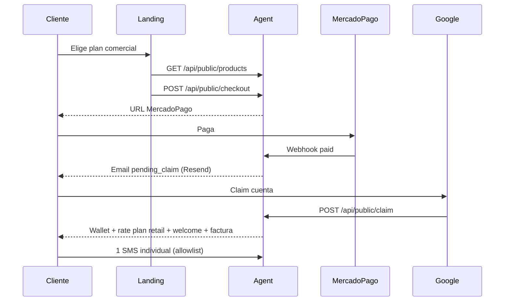

# Go-live controlado — primer cliente real (Telvoice Chile)

Documento operativo para entregar Telvoice a un cliente real bajo **producción controlada**. No sustituye runbooks de infraestructura ni incluye secretos.

Última revisión: mayo 2026.

---

## 1. Estado del sistema

| Componente | Estado esperado |
|------------|-----------------|
| Agent (`https://agent.telvoice.cl`) | `/health` → `status: ok` |
| Landing (`https://www.telvoice.cl`) | HTTP 200, checkout vía agent |
| Checkout público | `POST /api/public/checkout` |
| MercadoPago | Webhook en agent (sin fallback legacy en landing) |
| Emails transaccionales | `EMAIL_MODE=provider`, `EMAIL_PROVIDER=resend` |
| Billing | `BILLING_EMAIL_MODE=provider`, `BILLING_EMAIL_PROVIDER=resend` |
| Rate plan por defecto | TELVOICE CL Retail (`5002ddd5-0732-4bf5-affd-d1e692ca39f0`) |
| Envío SMS | `SMS_PROVIDER_MODE=live_test` + allowlist por empresa/número |

**Piloto validado:** Licantravel (compra MP, claim Google, wallet, billing, primer SMS con DLR).

---

## 2. Flujo cliente real



---

## 3. Pre-checks antes de entregar el link

- [ ] `/health` OK en agent.
- [ ] `/api/public/products` sin productos QA/test (sin “QA Unmapped”, sin nombres con `qa`, `test`, `prueba`, `unmapped`).
- [ ] Landing: `allowLegacyCheckoutFallback: false`, `showTestPurchaseChip: false`.
- [ ] Planes visibles alineados con catálogo agent (Starter 1.000 / $11.900, Business 15.000 / $124.950, Corporativo 100.000 / $595.000, bolsas Chile comerciales).
- [ ] PM2 agent online, sin errores recientes de checkout/email/billing.
- [ ] Cola `sms_send_queue`: sin ítems `pending` / `processing` inesperados.
- [ ] Cliente informado: solo **un número de prueba** acordado para el primer SMS (mientras `live_test`).

---

## 4. Qué puede hacer el cliente

- Comprar una bolsa/plan comercial desde el landing.
- Pagar con Mercado Pago.
- Reclamar la compra con Google (mismo email de checkout).
- Ver saldo en wallet, comprobante/factura por email.
- Enviar **SMS individual** controlado (1 destinatario, mensaje corto, sin campaña masiva).

---

## 5. Qué queda deshabilitado

| Capacidad | Control |
|-----------|---------|
| Campañas masivas reales | `campaigns_enabled=false` en rate plan retail |
| API client-facing | `api_enabled=false` |
| TPS alto | `max_tps=1` |
| Envío a números no autorizados | Allowlist `SMS_LIVE_TEST_*` mientras `live_test` |
| Checkout legacy landing | `allowLegacyCheckoutFallback: false` |
| Chip “Bolsa prueba” en calculadora | `showTestPurchaseChip: false` |
| Catálogo QA en API pública | Filtro código + metadata `customer_visible=false` / `segment=qa` |

`SMS_CAMPAIGN_ENABLED=true` a nivel plataforma **no** habilita campañas al cliente si su rate plan tiene `campaigns_enabled=false`.

---

## 6. Política para cliente nuevo (automática tras claim)

| Campo | Valor |
|-------|--------|
| `rate_plan_id` | `5002ddd5-0732-4bf5-affd-d1e692ca39f0` (TELVOICE CL Retail) |
| `max_tps` | 1 |
| `live_enabled` | true |
| `campaigns_enabled` | false |
| `api_enabled` | false |

Variables opcionales en agent (defaults en código si no están en `.env`):

- `PUBLIC_CHECKOUT_DEFAULT_RATE_PLAN_ID`
- `PUBLIC_CHECKOUT_DEFAULT_MAX_TPS=1`
- `PUBLIC_CHECKOUT_DEFAULT_CAMPAIGNS_ENABLED=false`
- `PUBLIC_CHECKOUT_DEFAULT_API_ENABLED=false`

---

## 7. Onboarding controlado

### 7.1 Antes de la compra

1. Confirmar plan comercial (evitar bolsas QA o chip de prueba).
2. Enviar link: `https://www.telvoice.cl`.

### 7.2 Tras el pago (soporte / superadmin)

3. Orden: `payment_status=paid`, `credit_status=pending_claim`, `claim_status=unclaimed`.
4. Email `payment_received_pending_claim` enviado (Resend).
5. **Sin** crédito en wallet antes del claim.

### 7.3 Tras el claim

6. `company` + `company_sms_wallet` creados.
7. `credit_status=credited`, `claim_status=claimed`.
8. Transacción `purchase_credit` única.
9. Rate plan TELVOICE CL Retail asignado (transactional + promotional).
10. Emails `welcome_sms_credited` y billing/comprobante (Resend).

### 7.4 Primer SMS (allowlist)

11. Obtener `company_id` del cliente.
12. Confirmar saldo y rate plan activo.
13. Acordar número de prueba (formato E.164, ej. `+569XXXXXXXX`).
14. En VPS `.env` del agent:
    - Añadir `company_id` a `SMS_LIVE_TEST_ALLOWED_COMPANY_IDS`
    - Añadir número a `SMS_LIVE_TEST_ALLOWED_NUMBERS`
15. `pm2 restart telvoice-sms-agent` → verificar `/health`.
16. Cliente envía **1 SMS** individual; auditar `panel_sms_messages`, DLR, débito wallet.

**Referencia piloto Licantravel**

- `company_id`: `54601663-f35f-4c26-9410-a9d2dc0ad697`
- Wallet: `6d873673-947b-4657-96f0-031d14db45fd`

---

## 8. Checklists de validación

### 8.1 Post-pago

| Campo / evento | Esperado |
|----------------|----------|
| `payment_status` | `paid` |
| `credit_status` | `pending_claim` |
| `claim_status` | `unclaimed` |
| Email | `payment_received_pending_claim` (Resend) |
| Wallet | Sin crédito |

### 8.2 Post-claim

| Campo / evento | Esperado |
|----------------|----------|
| `company` | Creada |
| Wallet | Creada con saldo |
| `credit_status` | `credited` |
| `claim_status` | `claimed` |
| `wallet_transactions` | `purchase_credit` × 1 |
| Rate plan | TELVOICE CL Retail |
| Emails | welcome + billing (Resend) |

### 8.3 Post-primer SMS

| Verificación | Esperado |
|--------------|----------|
| Mensaje en panel | `delivered` (o estado terminal coherente) |
| `provider_message_id` | Presente |
| Wallet | Débito 1 SMS |
| DLR | Recibido |
| Campaña masiva | No iniciada por cliente |

---

## 9. Reglas de catálogo público

Un paquete/producto aparece en `/api/public/products` solo si:

- `is_active = true`
- `customer_visible ≠ false` (metadata)
- `channel = web` y `segment = standard` (paquetes)
- No es QA/test/internal (nombre, `segment`, flags `qa` / `test` / `internal`)

Script de mantenimiento (VPS, con `DATABASE_URL`):

```bash
cd /var/www/telvoice-sms-agent
node scripts/hide-qa-catalog-products.mjs        # dry-run
node scripts/hide-qa-catalog-products.mjs --apply
```

QA sin pago:

```bash
node scripts/verify-catalog-public-qa.mjs
```

---

## 10. Riesgos pendientes antes de venta abierta

| Riesgo | Mitigación actual |
|--------|-------------------|
| Modo `live_test` + allowlist | Onboarding manual por cliente |
| Productos QA en BD | Filtro en código + script `hide-qa-catalog-products` |
| Desalineación landing ↔ agent | Match por `sms_quantity` + `price_amount`; solo planes comerciales visibles |
| Webhook MP duplicado (replay) | Idempotencia wallet; monitorear logs |
| Venta abierta sin control | No anunciar autoservicio SMS masivo hasta salir de live_test |

---

## 11. Qué no hacer en esta fase

- No habilitar campañas masivas, API pública ni TPS > 1 sin revisión telco.
- No cambiar `EMAIL_MODE`, `BILLING_EMAIL_MODE`, proveedores, rutas ni MercadoPago sin runbook.
- No activar RLS ni borrar datos históricos.
- No incluir secretos ni tokens de claim en tickets o documentación externa.
