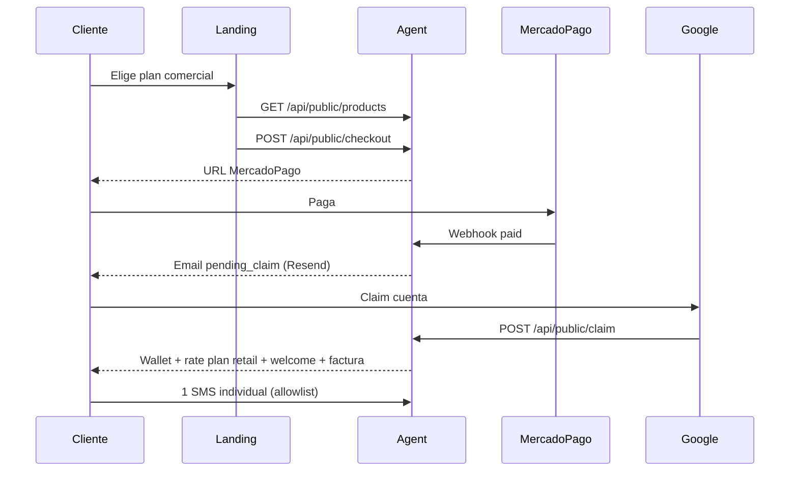

# Go-live controlado — primer cliente real (Telvoice Chile)

Documento operativo para entregar Telvoice a un cliente real bajo **producción controlada**. No sustituye runbooks de infraestructura ni incluye secretos.

Última revisión: mayo 2026.

---

## 1. Estado del sistema

| Componente | Estado esperado |
|------------|-----------------|
| Agent (`https://agent.telvoice.cl`) | `/health` → `status: ok` |
| Landing (`https://www.telvoice.cl`) | HTTP 200, checkout vía agent |
| Checkout público | `POST /api/public/checkout` |
| MercadoPago | Webhook en agent (sin fallback legacy en landing) |
| Emails transaccionales | `EMAIL_MODE=provider`, `EMAIL_PROVIDER=resend` |
| Billing | `BILLING_EMAIL_MODE=provider`, `BILLING_EMAIL_PROVIDER=resend` |
| Rate plan por defecto | TELVOICE CL Retail (`5002ddd5-0732-4bf5-affd-d1e692ca39f0`) |
| Envío SMS | `SMS_PROVIDER_MODE=live_test` + allowlist por empresa/número |

**Piloto operativo:** Licantravel — compra MP, claim Google, wallet, billing, SMS individual, **campaña productiva validada** (ref. abajo).

**Referencia campaña piloto (no borrar):**

| Campo | Valor |
|-------|--------|
| `campaign_id` | `f31d0b0d-fb76-416b-9791-26f14e20d69d` |
| Nombre | Producción Licantravel 001 |
| Resultado | 3/3 `delivered`, cola OK, aSMSC OK, sin débitos duplicados |
| Débito wallet | 6 SMS total (3 destinatarios × **2 segmentos** c/u — mensaje con Ñ → UCS-2) |

**Licantravel — dejar así (no tocar saldo, campaña ni proveedor):**

| Flag | Valor |
|------|--------|
| `campaigns_enabled` | true (transactional + promotional CL) |
| `api_enabled` | false |
| `max_tps` | 2 |
| `live_enabled` | true |

`company_id`: `54601663-f35f-4c26-9410-a9d2dc0ad697` · `wallet_id`: `6d873673-947b-4657-96f0-031d14db45fd`

---

## 2. Flujo cliente real



---

## 3. Pre-checks antes de entregar el link

- [ ] `/health` OK en agent.
- [ ] `/api/public/products` sin productos QA/test (sin “QA Unmapped”, sin nombres con `qa`, `test`, `prueba`, `unmapped`).
- [ ] Landing: `allowLegacyCheckoutFallback: false`, `showTestPurchaseChip: false`.
- [ ] Planes visibles alineados con catálogo agent (Starter 1.000 / $11.900, Business 15.000 / $124.950, Corporativo 100.000 / $595.000, bolsas Chile comerciales).
- [ ] PM2 agent online, sin errores recientes de checkout/email/billing.
- [ ] Cola `sms_send_queue`: sin ítems `pending` / `processing` inesperados.
- [ ] Cliente informado: solo **un número de prueba** acordado para el primer SMS (mientras `live_test`).

---

## 4. Qué puede hacer el cliente (tras onboarding)

- Comprar una bolsa/plan comercial desde el landing.
- Pagar con Mercado Pago.
- Reclamar la compra con Google (mismo email de checkout).
- Ver saldo en wallet, comprobante/factura por email.
- Enviar SMS individual y **campañas** desde el panel **solo si** `campaigns_enabled=true` en su `company_rate_plans` (habilitación manual post-claim; ver §12).

---

## 5. Qué queda deshabilitado por defecto

| Capacidad | Control |
|-----------|---------|
| Campañas masivas | `campaigns_enabled=false` al claim (retail default); habilitar **solo** por empresa cuando soporte autorice (§12) |
| API client-facing | `api_enabled=false` |
| TPS alto | `max_tps=1` o `2` según política |
| Checkout legacy landing | `allowLegacyCheckoutFallback: false` |
| Chip “Bolsa prueba” en calculadora | `showTestPurchaseChip: false` |
| Catálogo QA en API pública | Filtro código + metadata `customer_visible=false` / `segment=qa` |

`SMS_CAMPAIGN_ENABLED=true` a nivel plataforma **no** habilita campañas al cliente si su rate plan tiene `campaigns_enabled=false`.

**Campañas en producción real (cliente nuevo):** `SMS_CAMPAIGN_SKIP_NUMBER_WHITELIST=true` — sin allowlist de números en campañas; solo validación de móviles CL y dedupe de audiencia.

---

## 6. Política para cliente nuevo (automática tras claim)

| Campo | Valor |
|-------|--------|
| `rate_plan_id` | `5002ddd5-0732-4bf5-affd-d1e692ca39f0` (TELVOICE CL Retail) |
| `max_tps` | 1 |
| `live_enabled` | true |
| `campaigns_enabled` | false |
| `api_enabled` | false |

Variables opcionales en agent (defaults en código si no están en `.env`):

- `PUBLIC_CHECKOUT_DEFAULT_RATE_PLAN_ID`
- `PUBLIC_CHECKOUT_DEFAULT_MAX_TPS=1`
- `PUBLIC_CHECKOUT_DEFAULT_CAMPAIGNS_ENABLED=false`
- `PUBLIC_CHECKOUT_DEFAULT_API_ENABLED=false`

---

## 7. Onboarding controlado

### 7.1 Antes de la compra

1. Confirmar plan comercial (evitar bolsas QA o chip de prueba).
2. Enviar link: `https://www.telvoice.cl`.

### 7.2 Tras el pago (soporte / superadmin)

3. Orden: `payment_status=paid`, `credit_status=pending_claim`, `claim_status=unclaimed`.
4. Email `payment_received_pending_claim` enviado (Resend).
5. **Sin** crédito en wallet antes del claim.

### 7.3 Tras el claim

6. `company` + `company_sms_wallet` creados.
7. `credit_status=credited`, `claim_status=claimed`.
8. Transacción `purchase_credit` única.
9. Rate plan TELVOICE CL Retail asignado (transactional + promotional).
10. Emails `welcome_sms_credited` y billing/comprobante (Resend).

### 7.4 Primer SMS (allowlist)

11. Obtener `company_id` del cliente.
12. Confirmar saldo y rate plan activo.
13. Acordar número de prueba (formato E.164, ej. `+569XXXXXXXX`).
14. En VPS `.env` del agent:
    - Añadir `company_id` a `SMS_LIVE_TEST_ALLOWED_COMPANY_IDS`
    - Añadir número a `SMS_LIVE_TEST_ALLOWED_NUMBERS`
15. `pm2 restart telvoice-sms-agent` → verificar `/health`.
16. Cliente envía **1 SMS** individual; auditar `panel_sms_messages`, DLR, débito wallet.

**Referencia piloto Licantravel**

- `company_id`: `54601663-f35f-4c26-9410-a9d2dc0ad697`
- Wallet: `6d873673-947b-4657-96f0-031d14db45fd`

---

## 8. Checklists de validación

### 8.1 Post-pago

| Campo / evento | Esperado |
|----------------|----------|
| `payment_status` | `paid` |
| `credit_status` | `pending_claim` |
| `claim_status` | `unclaimed` |
| Email | `payment_received_pending_claim` (Resend) |
| Wallet | Sin crédito |

### 8.2 Post-claim

| Campo / evento | Esperado |
|----------------|----------|
| `company` | Creada |
| Wallet | Creada con saldo |
| `credit_status` | `credited` |
| `claim_status` | `claimed` |
| `wallet_transactions` | `purchase_credit` × 1 |
| Rate plan | TELVOICE CL Retail |
| Emails | welcome + billing (Resend) |

### 8.3 Post-primer SMS (opcional antes de campaña)

| Verificación | Esperado |
|--------------|----------|
| Mensaje en panel | `delivered` (o estado terminal coherente) |
| `provider_message_id` | Presente |
| Wallet | Débito = **segmentos del mensaje** (1 segmento GSM-7 → 1 SMS; UCS-2 con tildes/Ñ → 2+ SMS) |
| DLR | Recibido |
| Campaña masiva | No hasta habilitar `campaigns_enabled` |

---

## 9. Segmentos y débito wallet (importante)

El wallet descuenta **créditos SMS = segmentos × destinatarios aceptados**, no “1 SMS por número” si el mensaje se parte.

| Encoding | Ejemplo | Segmentos típicos |
|----------|---------|-------------------|
| GSM-7 | Sin tildes ni Ñ | 1 (mensaje corto) |
| UCS-2 | Con **ñ**, tildes, emojis | 2+ |

**Campaña Licantravel 001:** 3 destinatarios, 2 segmentos c/u → **6 SMS** debitados (correcto).

**Mensaje recomendado primera campaña cliente (1 segmento):**

```text
Hola, prueba de envio SMS Telvoice. Gracias por tu preferencia.
```

(Sin tildes ni caracteres especiales para evitar UCS-2.)

---

## 10. Reglas de catálogo público

Un paquete/producto aparece en `/api/public/products` solo si:

- `is_active = true`
- `customer_visible ≠ false` (metadata)
- `channel = web` y `segment = standard` (paquetes)
- No es QA/test/internal (nombre, `segment`, flags `qa` / `test` / `internal`)

Script de mantenimiento (VPS, con `DATABASE_URL`):

```bash
cd /var/www/telvoice-sms-agent
node scripts/hide-qa-catalog-products.mjs        # dry-run
node scripts/hide-qa-catalog-products.mjs --apply
```

QA sin pago:

```bash
node scripts/verify-catalog-public-qa.mjs
```

---

## 11. Riesgos pendientes antes de venta abierta

| Riesgo | Mitigación actual |
|--------|-------------------|
| Modo `live_test` + allowlist | Onboarding manual por cliente |
| Productos QA en BD | Filtro en código + script `hide-qa-catalog-products` |
| Desalineación landing ↔ agent | Match por `sms_quantity` + `price_amount`; solo planes comerciales visibles |
| Webhook MP duplicado (replay) | Idempotencia wallet; monitorear logs |
| Venta abierta sin control | No anunciar autoservicio SMS masivo hasta salir de live_test |

---

## 12. Checklist — primer cliente real con campañas

### 12.1 A. Post-pago (orden MP)

- [ ] `payment_status` = `paid`
- [ ] `credit_status` = `pending_claim`
- [ ] `claim_status` = `unclaimed`
- [ ] Email activación Resend (`payment_received_pending_claim`)
- [ ] **Sin** `purchase_credit` ni saldo en wallet antes del claim

### 12.2 B. Post-claim

- [ ] `company` creada → anotar `company_id`
- [ ] `company_sms_wallet` creada → anotar `wallet_id` y **saldo inicial**
- [ ] `wallet_transactions`: `purchase_credit` × 1
- [ ] Rate plan **TELVOICE CL Retail** (`5002ddd5-0732-4bf5-affd-d1e692ca39f0`) en transactional + promotional
- [ ] Welcome email Resend
- [ ] Comprobante / billing Resend

### 12.3 C. Habilitación campañas (solo esta empresa)

Ejecutar en BD (o Superadmin cartera) **solo** para el `company_id` del cliente:

```sql
UPDATE company_rate_plans
SET campaigns_enabled = true,
    api_enabled = false,
    live_enabled = true,
    max_tps = 1,  -- o 2 si soporte autoriza
    status = 'active'
WHERE company_id = '<CLIENT_COMPANY_ID>'
  AND country = 'CL'
  AND status = 'active';
```

- [ ] `campaigns_enabled` = true (CL transactional + promotional)
- [ ] `api_enabled` = false
- [ ] `max_tps` = 1 o 2
- [ ] No modificar otras empresas

### 12.4 D. Primera campaña cliente (10–50 contactos)

**Audiencia**

- [ ] Lista o selección con **10–50** contactos
- [ ] Solo móviles chilenos válidos
- [ ] Sin duplicados (preview reporta `duplicates_omitted` si aplica)
- [ ] Saldo ≥ costo estimado en preview

**Mensaje y sender**

- [ ] `sender_id` validado (alfanumérico aprobado; ej. marca del cliente)
- [ ] Texto corto **GSM-7** (plantilla §9)

**Preview antes de lanzar** (`/app/campaigns/new`)

- [ ] Destinatarios válidos
- [ ] Segmentos por mensaje (objetivo: **1**)
- [ ] Costo total SMS
- [ ] Saldo antes / estimado después
- [ ] Readiness OK (`canProceed` / sin bloqueos)
- [ ] `campaigns_enabled` = true en readiness

**Lanzamiento**

- [ ] Confirmar consentimiento + texto `ENVIAR`
- [ ] Anotar `campaign_id`

### 12.5 E. Auditoría post-lanzamiento

| Área | Qué revisar |
|------|-------------|
| `sms_campaigns` | `campaign_id`, `status`, `mode`, `metadata`, timestamps |
| `sms_send_queue` | `queued` → `processing` → `sent` / `failed`, `attempts`, `error_*` |
| `panel_sms_messages` | Cantidad = destinatarios válidos; `provider=asmsc`; `provider_message_id`; `sent`/`delivered`/`failed` |
| Wallet | Saldo antes/después; `sms_debit` por mensaje; **sin** débitos duplicados por mismo `reference_id` |
| DLR | Métrica principal: **estado final** en `panel_sms_messages`. Eventos raw en `panel_sms_delivery_events` pueden duplicar `delivered` (§13) — no bloquear cliente si estado final y wallet son correctos |

Scripts útiles (VPS):

```bash
node scripts/licantravel-campaign-001-audit.mjs <campaign_id>
```

### 12.6 Plantilla entregable por cliente

Completar tras onboarding + primera campaña:

| # | Campo | Valor |
|---|--------|--------|
| 1 | `order_id` | |
| 2 | `company_id` | |
| 3 | `wallet_id` | |
| 4 | Saldo inicial (post-claim) | |
| 5 | Rate plan asignado | TELVOICE CL Retail |
| 6 | `campaigns_enabled` final | true |
| 7 | `campaign_id` (1ª campaña) | |
| 8 | Destinatarios válidos | |
| 9 | Enviados | |
| 10 | Delivered | |
| 11 | Failed | |
| 12 | Saldo antes/después campaña | |
| 13 | Errores reales (si hay) | |
| 14 | Recomendación volumen | Ej. ampliar a 100–500 tras 0 failed y DLR estable |

---

## 13. Observación DLR (tarea técnica posterior)

En **Producción Licantravel 001** (`f31d0b0d-fb76-416b-9791-26f14e20d69d`) hubo **eventos `delivered` duplicados** en `panel_sms_delivery_events`, pero:

- Estado final en `panel_sms_messages` = correcto (`delivered`)
- Wallet = correcto (6 SMS, sin débitos duplicados)

**Política operativa:** no bloquear al cliente por duplicados en eventos raw.

**Tarea técnica (backlog):**

- Revisar idempotencia del webhook DLR (`delivered`)
- Reportes y dashboards: contar por **estado final del mensaje**, no por filas raw de eventos

---

## 14. Qué no hacer en esta fase

- No habilitar `campaigns_enabled` masivamente en todas las empresas.
- No subir `max_tps` > 2 ni habilitar API sin revisión telco.
- No cambiar `EMAIL_MODE`, `BILLING_EMAIL_MODE`, proveedores, rutas ni MercadoPago sin runbook.
- No activar RLS ni borrar datos históricos (incl. campaña Licantravel referencia).
- No incluir secretos ni tokens de claim en tickets o documentación externa.
- No lanzar segunda campaña grande desde Licantravel salvo pedido explícito de Victor.
