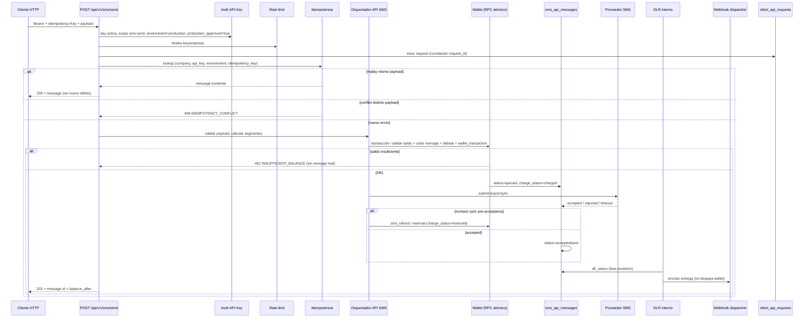

# Diseño técnico — Activación futura de envío SMS real por API (wallet, débito, reversión, idempotencia)

**Estado:** diseño pre-implementación (Fase 5)  
**Versión:** 1.0  
**Fecha:** 2026-05  
**Alcance:** documento únicamente — sin código productivo, migraciones ni activación de envío real.

**Documento relacionado:** [`api-real-sms-design.md`](./api-real-sms-design.md) (visión general API, tablas, auth, webhooks).

---

## Contexto actual (baseline congelado)

La API sandbox está operativa y auditada:

| Capacidad | Estado |
|-----------|--------|
| API Keys reales (`client_api_keys`) | Activo |
| Ambientes `sandbox` / `production` | Activo |
| Aprobación production (`production_approved`) | Activo — **no habilita envío** |
| `GET /api/v1/balance` | Activo |
| `POST /api/v1/sms/send` sandbox | Activo — **sin débito**, `cost_sms = 0` |
| Production send | Bloqueado — `403 PRODUCTION_SEND_NOT_ENABLED` |
| Idempotency-Key + `payload_hash` | Activo en sandbox (`sms_api_messages`) |
| `GET /api/v1/messages` / `:id` | Activo |
| Logs `client_api_requests` | Activo |
| Rate limits + overrides admin | Activo |
| Observabilidad `/admin/api-usage` | Activo |
| Wallet / `wallet_transactions` | Intacto — sin uso en API sandbox |

**Regla invariante hasta activación explícita:** ningún endpoint público debe descontar saldo ni conectar proveedor real sin pasar por las fases del roadmap (§14).

---

## 1. Visión general

### Flujo futuro end-to-end (production real)



### Orden de validaciones (production)

1. Autenticación Bearer + scopes.
2. Key `active`, no expirada/revocada/pausada.
3. `environment = production` **y** `production_approved = true`.
4. Flag operativo global `API_PRODUCTION_SEND_ENABLED` (fase posterior; hoy equivale a bloqueo duro).
5. Rate limit.
6. Validación JSON + segmentos.
7. **Idempotency-Key obligatorio** (production).
8. Resolución idempotencia (replay / conflict / proceed).
9. **Transacción wallet + mensaje** (atómica).
10. Envío proveedor (fuera de la transacción de débito).
11. Actualización estado + reversión condicional.
12. Log `client_api_requests` + respuesta HTTP.

Sandbox **no cambia:** sigue sin débito, `cost_sms = 0`, Idempotency-Key recomendado pero no obligatorio (comportamiento actual).

---

## 2. Reglas de negocio

| Regla | Detalle |
|-------|---------|
| **Quién puede enviar real** | Solo keys `environment = production`, `status = active`, `production_approved = true`, scope `sms:send`, empresa activa. |
| **Sandbox** | Sin descuento de saldo; `cost_sms = 0`; estados `sandbox_*`. |
| **Saldo requerido** | Antes de crear mensaje production con cobro: `available_sms >= segments`. |
| **Segmentos** | 1 SMS = 1 segmento (misma regla que sandbox: `calculateSimpleApiSmsSegments`). |
| **Saldo insuficiente** | No se crea mensaje con cobro; respuesta `402 INSUFFICIENT_BALANCE` (o `400` si se alinea con panel — decidir en implementación). |
| **Idempotency-Key (production)** | **Obligatorio.** Header `Idempotency-Key`, UUID v4, max 128 chars (validación ya existe en sandbox). |
| **Sin doble descuento** | Misma key + mismo `payload_hash` → replay del mismo `message_id`; **cero** débito adicional. |
| **Conflict idempotencia** | Misma key + distinto payload → `409 IDEMPOTENCY_CONFLICT`. |
| **Trazabilidad wallet** | Todo débito real debe tener fila en `wallet_transactions` (`type = sms_debit`) referenciando el mensaje API. |
| **Reversión** | Solo en errores técnicos **antes** de aceptación del proveedor (§9–10). No reembolso automático por DLR `failed` en fase inicial. |
| **Saldo negativo** | Prohibido — constraint DB `available_sms >= 0` en `company_sms_wallets`. |
| **Wallet congelado** | `status IN (frozen, suspended)` → rechazar débito (`400` / `403`). |

---

## 3. Modelo de saldo actual (solo documentación)

### Tabla `company_sms_wallets`

Migración `011_wallets_packages_orders.sql`. Una fila por `(company_id, country)`.

| Columna | Significado |
|---------|-------------|
| `available_sms` | Saldo disponible para enviar |
| `reserved_sms` | Saldo reservado (movido desde available) |
| `consumed_sms` | Acumulado histórico consumido |
| `total_purchased_sms` | Acumulado comprado |
| `status` | `active`, `frozen`, `suspended` |

Constraint: `available_sms >= 0`, `reserved_sms >= 0`.

### Servicio `smsWalletService.ts`

| Función | Uso actual |
|---------|------------|
| `getOrCreateCompanyWallet` / `getCompanyBalance` | Lectura/creación wallet |
| `readCompanyBalance` | Lectura sin crear fila (API balance) |
| `walletToBalanceView` | DTO para panel/API |
| `manualCreditWallet` / `manualDebitWallet` | Admin manual |
| `applyPurchaseCredit` | Acreditación post-compra (`smsOrderService`) |
| `reserveSms` | Mueve `available → reserved` + tx `reserve` — **definido, no usado en envíos panel/API hoy** |
| `releaseReservedSms` | Libera reserva + tx `release_reserved` |
| `debitSmsUsage` | Descuenta `available_sms`, incrementa `consumed_sms`, inserta tx `sms_debit` |

**Patrón panel (`smsSendService.ts`):** crea mensaje panel → envía proveedor → si no existe débito previo (`hasSmsDebitForMessage`) → `debitSmsUsage` con `reference_type = sms_message`, `reference_id = panel_message.id`. Si falla débito, marca mensaje `failed`.

### Tabla `wallet_transactions`

| Campo clave | Uso |
|-------------|-----|
| `type` | `purchase_credit`, `manual_credit`, `manual_debit`, `sms_debit`, `sms_refund`, `reserve`, `release_reserved`, `adjustment`, `reversal` |
| `sms_amount` | Cantidad SMS del movimiento |
| `balance_before` / `balance_after` | Snapshot |
| `reference_type` / `reference_id` | Enlace al origen (`sms_order`, `sms_message`, futuro `sms_api_message`) |
| `metadata` | Contexto adicional |

**Índice único existente:** un `purchase_credit` por orden (`reference_type = sms_order`).

**No existe aún** índice único para un solo `sms_debit` por mensaje API — se propone en §5.

### Acreditación de compras

Flujo MercadoPago / órdenes (`sms_orders`):

1. Pago confirmado → `applyPurchaseCredit` → `available_sms += quantity` + `wallet_transactions.purchase_credit`.
2. Idempotencia compra: `hasPurchaseCreditForOrder(orderId)`.

**Fuera de alcance** de este diseño; no modificar.

### UI saldo

| Superficie | Fuente |
|------------|--------|
| `/app/wallet` | `getCompanyBalance` + `listTransactionsByCompany` |
| `/app/dashboard` | KPIs vía servicios panel (incluye saldo resumido) |
| `GET /api/v1/balance` | `readCompanyBalance` — expone `available_sms`, `reserved_sms`, `consumed_sms` |
| Admin wallets | `listWalletsForAdmin`, crédito/débito manual |

---

## 4. Estrategias posibles

### A. Débito inmediato + reversión si falla proveedor

**Flujo:** en una transacción DB → validar saldo → crear mensaje → `sms_debit` → commit → llamar proveedor → si rechazo sync, `sms_refund`/`reversal`.

| Pros | Contras |
|------|---------|
| Alineado con patrón panel (`debitSmsUsage` post-envío, adaptable a pre-envío) | Riesgo de cobro + fallo proveedor → requiere reversión fiable |
| Saldo refleja intención de envío de inmediato | Reversión mal implementada = doble problema |
| Replay idempotente simple: mensaje ya existe con débito | Timeout proveedor deja cobro sin certeza de entrega |
| Menos estados intermedios (`reserved`) | |

### B. Reserva de saldo + confirmación posterior

**Flujo:** `reserveSms` → crear mensaje `charge_status=reserved` → proveedor acepta → convertir reserva en consumo (`debit` desde reserved); si falla → `release_reserved`.

| Pros | Contras |
|------|---------|
| `available_sms` visible al cliente no baja hasta confirmación | `reserveSms` existe pero **no se usa** en ningún flujo productivo hoy |
| Separa intención vs consumo real | Dos pasos + más estados (`reserved`, `charged`, `released`) |
| Menor necesidad de reembolso | `reserved_sms` puede acumularse si jobs fallan |
| | Race: reservas concurrentes requieren `SELECT FOR UPDATE` |

### C. Débito solo después de accepted por proveedor

**Flujo:** crear mensaje sin cobro → proveedor → si `accepted`, entonces `debitSmsUsage`.

| Pros | Contras |
|------|---------|
| No cobras lo no aceptado | Ventana sin cobro: retries/duplicados peligrosos |
| Similar al panel actual (débito post-submit) | Idempotencia + débito desacoplados: más carrera |
| | Saldo puede agotarse entre aceptación y débito |
| | Mensaje “aceptado” sin fondos = inconsistencia |

### Recomendación para primera fase real

**Estrategia A refinada — débito inmediato dentro de transacción DB atómica, antes de llamar al proveedor**, con reversión (`sms_refund`) únicamente en rechazo síncrono pre-acceptance.

**Motivos:**

1. El wallet ya expone `debitSmsUsage` y el panel ya cobra por mensaje con `hasSmsDebitForMessage` como guarda.
2. `reserveSms` está implementado pero sin adopción; introducir reservas en API añade complejidad operativa sin beneficio claro en envío unitario.
3. La idempotencia ya ancla en `sms_api_messages` — el débito debe ocurrir **en la misma transacción** que el insert del mensaje para que replay nunca re-debite.
4. Estrategia C deja el peor escenario de carrera entre aceptación proveedor y débito.

**Reserva (B)** reservar para **Fase 5.7 bulk**, donde un lote puede reservar N segmentos antes de procesar cola.

---

## 5. Tablas o campos propuestos

> Definición de diseño. **No aplicar** hasta Fase 5.1.

### A. Extensiones en `sms_api_messages`

| Columna | Tipo | Notas |
|---------|------|-------|
| `wallet_transaction_id` | `uuid NULL` FK → `wallet_transactions` | Débito principal |
| `reversal_transaction_id` | `uuid NULL` FK → `wallet_transactions` | Reversión/refund si aplica |
| `charged_segments` | `integer NOT NULL DEFAULT 0` | Segmentos efectivamente cobrados |
| `charge_status` | `text NOT NULL DEFAULT 'not_charged'` | Ver enum abajo |

**Enum `charge_status`:**

| Valor | Significado |
|-------|-------------|
| `not_charged` | Sandbox o production pre-cobro |
| `reserved` | Reserva activa (fase bulk futura) |
| `charged` | Débito confirmado |
| `reversed` | Reversión aplicada |
| `failed` | Falló el cobro (error técnico) |

**Ampliar `status` CHECK** para production:

- Mantener sandbox: `sandbox_accepted`, `sandbox_rejected`
- Production: `queued`, `accepted`, `sent`, `delivered`, `failed`, `expired`, `rejected`, `charge_failed`

**Índices adicionales sugeridos:**

```sql
-- Un solo débito por mensaje API
CREATE UNIQUE INDEX IF NOT EXISTS idx_wallet_tx_sms_api_debit_unique
  ON wallet_transactions (reference_id)
  WHERE reference_type = 'sms_api_message' AND type = 'sms_debit';

-- Opcional: un solo refund por mensaje
CREATE UNIQUE INDEX IF NOT EXISTS idx_wallet_tx_sms_api_refund_unique
  ON wallet_transactions (reference_id)
  WHERE reference_type = 'sms_api_message' AND type IN ('sms_refund', 'reversal');
```

Referencia en débito: `reference_type = 'sms_api_message'`, `reference_id = sms_api_messages.id` (distinto del panel `sms_message`).

### B. Tabla `wallet_debit_locks` — ¿hace falta?

**Recomendación: NO en Fase 5.1–5.3.**

La idempotencia ya está cubierta por:

- Índice único `sms_api_messages (company_id, api_key_id, environment, idempotency_key)` (migración 036).
- Propuesta de índice único en `wallet_transactions` por mensaje.
- Replay devuelve mensaje existente antes de cualquier lógica de cobro.

**Cuándo reconsiderar:** bulk API con un solo Idempotency-Key para N destinatarios, o cola async con reintentos internos que puedan duplicar débito fuera del insert idempotente.

Si en el futuro se necesita:

| Columna | Tipo |
|---------|------|
| `id` | uuid PK |
| `company_id` | uuid NOT NULL |
| `api_key_id` | uuid NOT NULL |
| `message_id` | uuid NULL FK |
| `idempotency_key` | text NOT NULL |
| `segments` | integer NOT NULL |
| `status` | text — `pending`, `committed`, `released` |
| `wallet_transaction_id` | uuid NULL |
| `created_at` / `updated_at` | timestamptz |

UNIQUE `(company_id, api_key_id, idempotency_key)`.

---

## 6. Transacciones atómicas

### Problema

Hoy `debitSmsUsage` y `insertWalletTransaction` son llamadas Supabase separadas desde Node. Entre ellas (y entre insert mensaje y débito) hay ventana de fallo parcial:

- Mensaje creado sin débito.
- Débito sin mensaje.
- Doble débito en carrera (mitigado por `hasSmsDebitForMessage` en panel, pero **sin UNIQUE DB** para API).

### Diseño objetivo

**Una sola unidad atómica** para el camino feliz production:

```
BEGIN;
  SELECT * FROM company_sms_wallets WHERE company_id = ? AND country = ? FOR UPDATE;
  -- validar status active, available_sms >= segments
  INSERT INTO sms_api_messages (... charge_status = 'charged', cost_sms = segments ...);
  UPDATE company_sms_wallets SET available_sms = available_sms - segments, consumed_sms = consumed_sms + segments;
  INSERT INTO wallet_transactions (type = 'sms_debit', reference_type = 'sms_api_message', ...);
  UPDATE sms_api_messages SET wallet_transaction_id = ...;
COMMIT;
```

Si cualquier paso falla → `ROLLBACK` completo.

### RPC propuesta: `api_sms_debit_and_create_message`

Función SQL `SECURITY DEFINER` invocada con service role desde `smsApiMessageService` (production path).

**Entrada:** `company_id`, `api_key_id`, `request_id`, payload normalizado, `segments`, `idempotency_key`, `payload_hash`, `environment`.

**Salida:** fila mensaje + `balance_after` + `wallet_transaction_id`.

**Errores mapeados:**

| Código SQL / excepción | HTTP API |
|------------------------|----------|
| Saldo insuficiente | `402 INSUFFICIENT_BALANCE` |
| Wallet frozen/suspended | `403 WALLET_FROZEN` |
| Unique idempotency | delegar a capa app → replay/conflict |
| Otros | `500 INTERNAL_ERROR` |

**Envío proveedor:** **fuera** del RPC, después del commit. Si proveedor rechaza sync:

```sql
-- rpc api_sms_refund_message(message_id) en transacción separada
BEGIN;
  SELECT wallet FOR UPDATE;
  INSERT wallet_transactions type = sms_refund;
  UPDATE wallet SET available_sms += segments, consumed_sms -= segments;
  UPDATE sms_api_messages SET charge_status = 'reversed', reversal_transaction_id = ...;
COMMIT;
```

### Alternativa sin RPC (no recomendada)

Encadenar llamadas Supabase desde Node con compensación manual. Rechazada por riesgo de estados parciales bajo timeout/retry.

---

## 7. Idempotencia real (production)

### Baseline sandbox (implementado)

Archivo: `smsApiMessageService.ts` → `resolveSandboxSmsSend`.

- Header `Idempotency-Key` validado (`validateIdempotencyKeyHeader`).
- `payload_hash = SHA256(canonical JSON payload)`.
- Lookup en `sms_api_messages` por `(company_id, api_key_id, environment, idempotency_key)`.
- Mismo hash → `{ outcome: "replay" }`, HTTP **200**.
- Distinto hash → `{ outcome: "conflict" }`, HTTP **409 IDEMPOTENCY_CONFLICT**.
- Unique index previene duplicados en carrera.

Sandbox: **sin débito** en replay ni en create.

### Comportamiento production (propuesto)

| Caso | Comportamiento |
|------|----------------|
| Sin `Idempotency-Key` | `400 MISSING_IDEMPOTENCY_KEY` (nuevo código; hoy sandbox lo trata como opcional) |
| Primera request, saldo OK | Transacción atómica → 202 + message |
| Replay, mismo payload, mensaje ya cobrado | 200 + mismo `message.id`, `idempotent_replay: true`, **sin RPC débito** |
| Replay, mensaje existe, cobro pendiente (estado imposible si RPC es atómico) | 200 + message (no re-debitar) |
| Misma key, distinto payload | 409 `IDEMPOTENCY_CONFLICT` |
| Cliente retry tras timeout HTTP post-débito | Replay devuelve mensaje existente — **no segundo débito** |
| Cliente retry con **nueva** key, mismo payload | **Nuevo envío y nuevo débito** — responsabilidad del cliente |

### TTL idempotencia

Sandbox: persistencia indefinida vía fila mensaje (no TTL hoy).

**Production recomendado:** retención mínima **24–72 h** por key para dedup; la fila mensaje permanece para auditoría. El índice único no debe expirar si el mensaje sigue existiendo.

### Relación con `sms_send_idempotency` (panel)

Tabla `sms_send_idempotency` (migración 020) es **solo panel** (`/app/sms`). La API pública **no** debe reutilizarla; la fuente de verdad idempotente es `sms_api_messages` + `wallet_transactions`.

---

## 8. Estados de mensaje real

### Cuatro dimensiones ortogonales

| Dimensión | Campo | Valores |
|-----------|-------|---------|
| **Estado API** | `status` | `queued`, `accepted`, `sent`, `delivered`, `failed`, `expired`, `rejected`, `charge_failed`, + sandbox |
| **Estado proveedor** | `metadata.provider_status` o columna futura | `submitted`, `accepted`, `rejected`, `unknown` |
| **Estado DLR** | `dlr_status` | `pending`, `delivered`, `failed`, `expired`, `unknown` |
| **Estado de cobro** | `charge_status` | `not_charged`, `reserved`, `charged`, `reversed`, `failed` |

### Máquina de estados simplificada (production)

```
[RPC exitoso] → queued (charge_status=charged)
       ↓
   proveedor sync OK → accepted
       ↓
   DLR / polling → sent → delivered
       
   proveedor sync REJECT → failed + charge_status=reversed
   timeout proveedor → accepted|queued + provider_status=unknown (sin reversión auto)
   error débito en RPC → no message / charge_failed
```

### Respuesta API vs estado interno

| HTTP | Condición |
|------|-----------|
| `202 Accepted` | Mensaje creado y cobrado; envío proveedor encolado o en curso |
| `200 OK` | Replay idempotente |
| `402` | Saldo insuficiente (sin fila mensaje cobrada) |
| `403` | Key/production/wallet bloqueado |
| `409` | Idempotency conflict |

El cliente consulta evolución vía `GET /api/v1/messages/:id`.

---

## 9. Manejo de errores proveedor

| Escenario | Acción wallet | Acción mensaje |
|-----------|---------------|----------------|
| Rechazo síncrono (número inválido, cuenta suspendida, etc.) | **Reversión** (`sms_refund`) | `status=rejected`, `charge_status=reversed` |
| Aceptación síncrona | Sin cambio | `status=accepted`, `provider_message_id` poblado |
| Timeout / error red (estado desconocido) | **Sin reversión** | `status=queued`, flag `metadata.provider_unknown=true` |
| Error post-acceptance vía DLR `failed` | **Sin reversión** (fase inicial) | `dlr_status=failed`, `status=failed` |
| Error técnico interno post-débito pre-proveedor | Reversión | `charge_status=reversed` |

### Reconciliación

Job admin / script:

- Mensajes `provider_unknown` > N minutos → consulta proveedor o marcar `failed` manual.
- Panel `/admin/api-usage` → acción “Revertir cobro” solo superadmin, auditada, solo si `charge_status=charged` y sin `provider_message_id`.

---

## 10. DLR y reversión

### Política inicial (recomendada)

| Evento DLR | ¿Revertir saldo? |
|------------|------------------|
| Rechazo proveedor **antes** de `provider_message_id` | **Sí** (ya cubierto en sync) |
| DLR `delivered` | No |
| DLR `failed` / `expired` | **No** (fase inicial) |
| DLR `rejected` | **No** automático — evaluar caso por caso en soporte |

**Motivo:** en SMS prepago, el costo suele incurrirse al submit/accept del SMSC, no al delivery. Revertir automáticamente por DLR failed genera abuso y discrepancia con panel.

### Fase posterior

Política comercial configurable por empresa o ruta (`refund_on_dlr_failed boolean`) — **no implementar en 5.1–5.5**.

---

## 11. Webhooks

Impacto sobre wallet: **ninguno**. Los webhooks son read-only respecto al saldo.

| Principio | Detalle |
|-----------|---------|
| Disparo | Tras cambio material de `status` o `dlr_status` (`message.accepted`, `message.delivered`, `message.failed`) |
| No bloquear envío | Fallo webhook no revierte débito |
| Cola | Tabla `client_webhook_deliveries` (diseño en `api-real-sms-design.md`) |
| Reintentos | Backoff; dead-letter en admin |
| Payload | Incluir `message.id`, `charge_status`, `segments`, **no** incluir texto completo si política PII restrictiva |

Orden: **commit wallet/mensaje → submit proveedor → update estado → encolar webhook**.

---

## 12. Auditoría admin

Extensión propuesta en `/admin/api-usage` (detalle mensaje / request):

| Campo visible | Fuente |
|---------------|--------|
| Mensaje real vs sandbox | `environment`, `status` |
| `charged_segments` | columna |
| `charge_status` | columna + badge |
| `wallet_transaction_id` | link a movimiento |
| `reversal_transaction_id` | si existe |
| Proveedor | `metadata.provider` / `provider_message_id` |
| Error proveedor | `metadata.provider_error` |
| `idempotency_key` | columna (parcialmente enmascarada opcional) |
| `production_approved` at time of send | snapshot en `client_api_requests.metadata` |

**No mostrar:** `key_hash`, key completa, body completo con PII repetida.

Filtros admin futuros: `charge_status=charged`, `environment=production`, `provider_message_id IS NULL` (stuck).

---

## 13. Riesgos

| Riesgo | Mitigación diseñada |
|--------|---------------------|
| **Doble débito** | RPC atómico + UNIQUE `wallet_transactions` por mensaje + idempotencia mensaje |
| **Envío duplicado** | Idempotency-Key obligatorio production; unique index |
| **Saldo negativo** | `FOR UPDATE` + CHECK constraint + validación en RPC |
| **Timeout proveedor** | Estado `unknown`; job reconciliación; **no** reversión automática |
| **Accepted vs delivered** | Dimensiones separadas; cobro al charged, no al DLR |
| **Reversión indebida** | Solo pre-acceptance sync; acciones admin auditadas |
| **Retry cliente** | Replay idempotente devuelve mismo message |
| **Race concurrente misma key** | Unique index → un insert gana, otro replay/conflict |
| **Idempotency-Key ausente** | 400 en production |
| **Bulk miles de destinos** | Fuera de Fase 5.1; reserva + cola + rate limit estricto |
| **Respuesta HTTP perdida post-débito** | Cliente replay con misma key → 200 sin re-debito |
| **Panel vs API doble cobro mismo destino** | Distintos `reference_type`; no compartir idempotency cross-surface |
| **Activación accidental production** | Flag env + `production_approved` + allowlist empresa demo |

---

## 14. Roadmap recomendado

| Fase | Entregable | Wallet |
|------|------------|--------|
| **5.1** | Migración campos `charge_status`, `wallet_transaction_id`, índices UNIQUE | Sin activar descuento |
| **5.2** | `POST /api/v1/sms/send?dry_run=1` o header `X-Telvoice-Dry-Run: 1` — valida saldo/segmentos, **no** inserta mensaje cobrado | Solo lectura |
| **5.3** | RPC `api_sms_debit_and_create_message`; production send solo **empresa demo** + flag env | Débito real acotado |
| **5.4** | Proveedor mock (acepta/rechaza/timeout configurable) | Débito + reversión sync |
| **5.5** | Proveedor real; gate admin `production_send_enabled` por empresa | Débito real gradual |
| **5.6** | DLR + webhooks reales | Sin cambio en reglas de reversión |
| **5.7** | Bulk API + reserva opcional (`reserveSms`) | Reserva → confirmación por lote |

Cada fase: QA script dedicado, auditoría wallet before/after, rollback plan (desactivar flag env).

---

## 15. Recomendación final

### Qué estrategia usar primero

**Débito inmediato en transacción SQL atómica (RPC)** + **reversión solo en rechazo síncrono pre-acceptance**, reutilizando tipos `sms_debit` / `sms_refund` ya definidos en `wallet_transactions`.

La idempotencia de production debe extender el patrón sandbox existente (`idempotency_key` + `payload_hash` en `sms_api_messages`), con Idempotency-Key **obligatorio** y replay **sin segundo débito**.

### Qué NO hacer todavía

- No quitar `PRODUCTION_SEND_NOT_ENABLED` sin pasar por 5.1–5.3.
- No conectar SMPP/proveedor real antes de 5.4–5.5.
- No revertir automáticamente por DLR `failed`.
- No implementar bulk production.
- No habilitar RLS.
- No debitar sandbox.
- No reutilizar `sms_send_idempotency` del panel para API.
- No confiar solo en lógica Node secuencial sin RPC/UNIQUE DB.

### Condiciones previas a activar envío real

1. Migración 5.1 aplicada y verificada en staging.
2. RPC atómico con tests de carrera (concurrencia misma idempotency key).
3. Índice UNIQUE débito por mensaje API.
4. QA: saldo insuficiente, replay, conflict, reversión sync, wallet intacto en sandbox.
5. `production_approved = true` + flag operativo + allowlist empresa.
6. Runbook admin: mensajes stuck, reversión manual, pausa key.
7. Auditoría de cierre firmada (como sandbox y production approval).
8. Acuerdo comercial sobre DLR y reembolsos documentado.

---

## Apéndice A — Mapeo código existente → production

| Componente actual | Archivo | Uso en production |
|-------------------|---------|-------------------|
| Auth API Key | `clientApiKeyService.ts` | + check `productionApproved` |
| Balance | `readCompanyBalance` | Sin cambio |
| Idempotencia API | `smsApiMessageService.ts` | Extender `resolveProductionSmsSend` |
| Débito | `debitSmsUsage` | Lógica movida/reforzada en RPC |
| Guard débito panel | `hasSmsDebitForMessage` | Equivalente `hasSmsDebitForApiMessage` |
| Log request | `recordPublicApiRequest` | + metadata `charge_status`, `wallet_transaction_id` |
| Bloqueo production | `public-api-sms-send.controller.ts` | Reemplazar gradualmente por gates 5.2–5.3 |

## Apéndice B — Códigos de error API nuevos (propuesta)

| Código | HTTP | Cuándo |
|--------|------|--------|
| `MISSING_IDEMPOTENCY_KEY` | 400 | Production sin header |
| `INSUFFICIENT_BALANCE` | 402 | Saldo < segmentos |
| `WALLET_FROZEN` | 403 | Wallet frozen/suspended |
| `PRODUCTION_NOT_APPROVED` | 403 | Key production sin aprobación |
| `PRODUCTION_SEND_NOT_ENABLED` | 403 | Flag global off (hoy) |
| `IDEMPOTENCY_CONFLICT` | 409 | Ya existe (sandbox hoy) |
| `CHARGE_FAILED` | 500 | Fallo RPC débito |

---

*Documento generado como base para Fase 5. No implica activación de envío real ni modificaciones a wallet en producción.*
