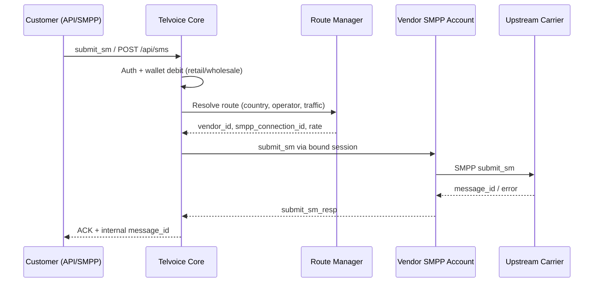
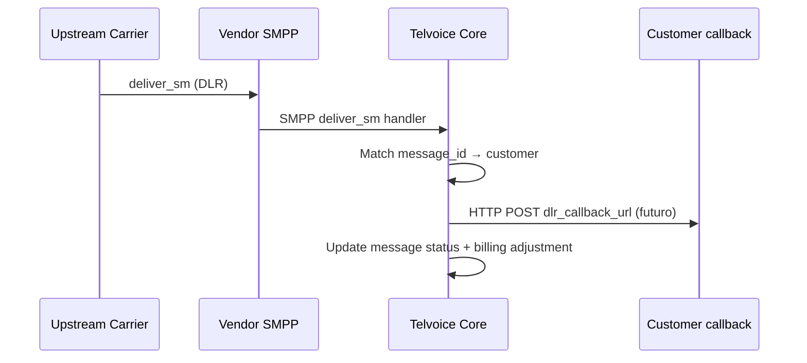

# Telvoice SMPP / Wholesale — Business Operating Model

Documento interno de arquitectura operativa para el superadmin Telvoice.
Referencia visual: aSMSC (Vendor Management, Rate Plan Manager, Route Manager).
Rama de trabajo: `feature/smpp-lab-wholesale-ops`.

---

## 1. Modelo de negocio: Retail vs Wholesale

| Dimensión | Retail Chile (`Telvoice.cl`) | Wholesale internacional (`Telvoice.net`) |
|-----------|------------------------------|------------------------------------------|
| Cliente | Empresa chilena, panel `/app` | Carrier / agregador / reseller internacional |
| Producto | Bolsas SMS prepago | Rutas terminales + conectividad SMPP/API |
| Pago | MercadoPago, wallet CLP | Crédito USD/EUR, facturación wholesale |
| Routing | Proveedores Chile (`/admin/providers`) | Vendors + SMPP accounts + routes intl. |
| Conectividad | HTTP API Telsim / rutas CL | SMPP bind transceiver hacia carriers |
| Rate model | Bolsa fija por volumen | Buy rate (vendor) → sell rate (customer) → margin |
| DLR | Webhook retail / panel | DLR SMPP + callback URL por cliente (futuro) |
| NOC | Tráfico Chile, campañas | Bind status, TPS vendor, errores SMPP |

**Principio:** mismo proceso Node (`agent.telvoice.cl` / `admin.telvoice.cl`), dominios separados por host.
Retail no se modifica al extender wholesale.

---

## 2. Jerarquía de datos

```
wholesale_providers (Vendor)
  └── wholesale_smpp_connections (Vendor SMPP Account) [1:N]
        └── wholesale_international_rate_plans (Vendor Rate / Buy side) [1:N]
              └── wholesale_routes (Route Manager / Termination) [1:N]
                    └── wholesale_route_tests (Route Tests)

wholesale_customers (Customer Account)
  └── [futuro] customer_smpp_accounts / api_keys [1:N]
        └── [futuro] customer_rate_plans (Sell Rates) [1:N]
              └── wallet / credit_limit (Billing)
```

**Tablas actuales (050/051):**

| Entidad | Tabla | Notas |
|---------|-------|-------|
| Vendor | `wholesale_providers` | `code` único, ej. `ptg_pacific` |
| Vendor SMPP Account | `wholesale_smpp_connections` | `password_encrypted`, campos aSMSC 051 |
| Vendor Rate Plan | `wholesale_international_rate_plans` | cost_price = buy, sale_price = sell draft |
| Route | `wholesale_routes` | FK `smpp_connection_id`, `rate_plan_id` |
| Route Test | `wholesale_route_tests` | Prueba manual pre-live |
| Customer | `wholesale_customers` | Comercial wholesale |
| Bind Test | `wholesale_smpp_bind_tests` | Solo conexión, no SMS |
| Send Test | `wholesale_smpp_send_tests` | Submit controlado superadmin |

---

## 3. Menú superadmin propuesto

### A. Retail Chile
Dashboard · Clientes · Bolsas · Órdenes · Wallets · Campañas · Mensajería · DLR · Proveedores CL · Rutas CL · Tráfico · Test envío

### B. Wholesale internacional
Dashboard · **Vendors** · **Vendor SMPP Accounts** · **Vendor Rate Plans** · **Route Manager** · Customer Accounts · Customer SMPP/API *(próx.)* · Customer Rate Plans *(próx.)* · Route Tests · Opportunities

### C. NOC / Traffic
SMPP Bind Status *(→ SMPP Lab)* · Traffic Monitor *(próx.)* · DLR Monitor *(próx.)* · Error Codes *(próx.)* · Alerts *(próx.)*

### D. Billing
Vendor Billing *(próx.)* · Customer Billing *(próx.)* · Invoices · Settlements *(próx.)* · Margins *(próx.)*

### E. System
API · Emails · Users *(próx.)* · Settings · Support

Ítems marcados *próx.* aparecen en sidebar como "Próximamente" o solo en este documento hasta tener backend.

---

## 4. Relaciones operativas

### Vendor → SMPP Accounts → Vendor Rates → Routes

1. **Vendor** (`wholesale_providers`): carrier upstream (PTG Pacific Telecom, Almuqeet, …).
2. **Vendor SMPP Account** (`wholesale_smpp_connections`): credenciales bind, TPS, credit limit, moneda.
   - Múltiples cuentas por vendor (ej. PTG_2WAY, PTG_OTP).
3. **Vendor Rate Plan** (`wholesale_international_rate_plans`):
   - **Buy rate** = `cost_price` (lo que pagamos al vendor).
   - **Sell rate** = `sale_price` (borrador comercial; customer rates futuro).
   - **Termination rate** = precio efectivo en ruta (`wholesale_routes.cost` / `sale_price`).
4. **Route** (`wholesale_routes`): enlace vendor + SMPP account + rate plan + destino (país/operador/tráfico).

### Customer → SMPP/API Accounts → Customer Rates → Wallet

*(Fase futura — documentado, no implementado)*

| Campo futuro | Propósito |
|--------------|-----------|
| `customer_smpp_accounts` | N cuentas SMPP por cliente wholesale |
| `api_keys` | REST API con scope y TPS |
| `dlr_callback_url` | Webhook DLR por cliente |
| `tps_limit` | Throttle por cliente |
| `assigned_rate_plan_id` | Sell rate aplicado |
| `wallet_balance` / `credit_limit` | Billing prepago/postpago |

---

## 5. Flujo mensaje MT (Mobile Terminated)



**Estado actual wholesale:** registro de cuentas, bind test, route/rate en draft.
Routing MT automático wholesale = fase posterior.

---

## 6. Flujo DLR (Delivery Receipt)



Retail DLR: `/admin/dlr` (Chile).
Wholesale DLR monitor: NOC *(próx.)*.

---

## 7. Flujo billing

| Evento | Retail | Wholesale (objetivo) |
|--------|--------|----------------------|
| Compra bolsa | MercadoPago → wallet CLP | — |
| Submit SMS | Debit wallet por segmento | Debit customer credit USD |
| Vendor cost | — | Accrue buy rate × segments |
| Invoice | Factura retail | Vendor settlement + customer invoice |
| Margin | Bolsa − costo ruta CL | sell_rate − buy_rate por ruta |

**Fase actual:** tablas wholesale + rate plans draft; billing engine wholesale *(próx.)*.

---

## 8. Flujo rate update

1. Vendor envía rate sheet (email/WhatsApp) → **Ofertas rates** (`/admin/wholesale/rates`) raw text.
2. Ops parsea manualmente → **Vendor Rate Plans** (`cost_price`).
3. Comercial define **sell rate** en rate plan o route.
4. Route Manager recalcula margen (`cost`, `sale_price`, margin %).
5. Status workflow: `draft` → `testing` → `approved` → `live`.
6. *(Futuro)* Auto-import desde vendor SMPP account flag `auto_import_enabled`.

---

## 9. Flujo route testing

1. Route en `testing` con SMPP account bind OK.
2. **Test bind** (`wholesale_smpp_bind_tests`) — solo sesión, sin SMS.
3. **Send test SMS** (`wholesale_smpp_send_tests`) — submit controlado superadmin.
4. **Route test** manual (`wholesale_route_tests`) — número destino, DLR observado.
5. Promoción a `live` tras aprobación ops.

---

## 10. Flujo NOC

| Señal | Fuente | Pantalla |
|-------|--------|----------|
| Bind up/down | `wholesale_smpp_bind_tests` | SMPP Lab / NOC Bind Status |
| Last bind per account | enriched connection | Vendor edit → SMPP Accounts |
| TPS / queue | *(futuro)* metrics | Traffic Monitor |
| DLR ratio | send tests + route tests | DLR Monitor |
| SMPP error codes | bind/send test errors | Error Codes |
| Credit limit | `credit_limit` en connection | Vendor account overview |

Dashboard wholesale hub muestra snapshot SMPP NOC (`buildSmppNocSnapshot`).

---

## 11. Caso PTG_2WAY (PTG Pacific Telecom)

| Campo | Valor |
|-------|-------|
| Vendor code | `ptg_pacific` |
| Account Name | `PTG_2WAY` |
| Host | `213.239.210.94` |
| Ports | 7777 / 7777 |
| System ID | `telvoice.2way` |
| Bind | transceiver |
| Status inicial | `testing` |

**Flujo operativo:**

1. Vendor edit → tab **SMPP Accounts** → **New SMPP Account** (prefill automático PTG).
2. Operador ingresa password en formulario (nunca en logs).
3. Guardar → `password_encrypted` con `ENCRYPTION_KEY`.
4. **Test bind** (máx. 2 intentos) — pendiente autorización ops.
5. Crear rate plans RO/GB/CL en draft.
6. Vincular route en Route Manager.
7. Send test SMS solo con destino autorizado.

Preset UI: `src/config/smpp-vendor-presets.ts` (`PTG_PACIFIC_CODE = "ptg_pacific"`).

---

## 12. Compatibilidad y restricciones

- URLs existentes `/admin/wholesale/*` se mantienen.
- No renombrar tablas sin migración.
- Retail (checkout, MP, wallet, órdenes) fuera de alcance wholesale.
- Credenciales SMPP: cifrado obligatorio en producción (`ENCRYPTION_KEY`).

---

## 13. Roadmap por fases

| Fase | Entregable |
|------|------------|
| **Actual** | Nav reorganizado, vendor tabs, SMPP accounts por vendor, rate/route UI alineada aSMSC |
| **Siguiente** | Test bind PTG_2WAY, rate plans RO/GB con precio real |
| **+1** | Customer SMPP/API accounts, API keys, DLR callback |
| **+2** | MT routing engine wholesale, billing settlements |
| **+3** | NOC monitors en tiempo real, auto rate import |
